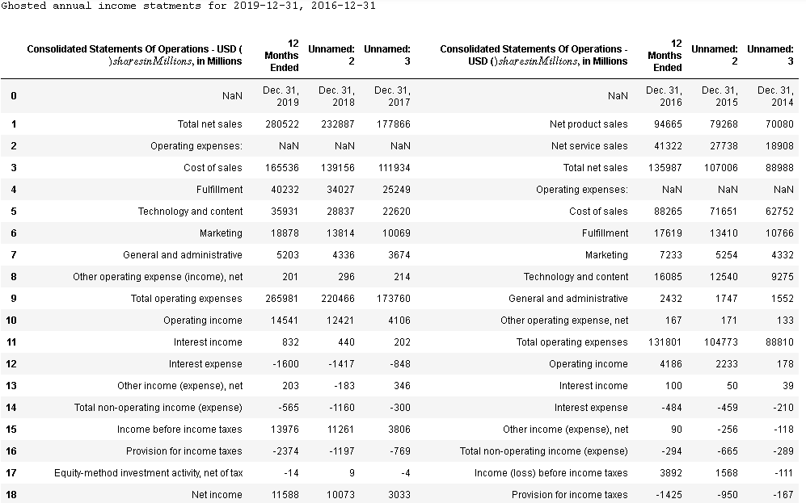
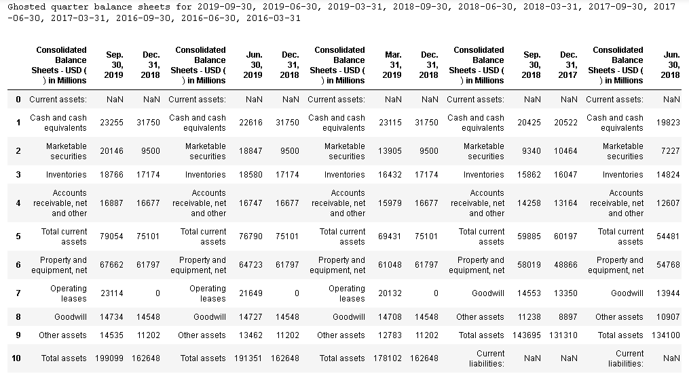
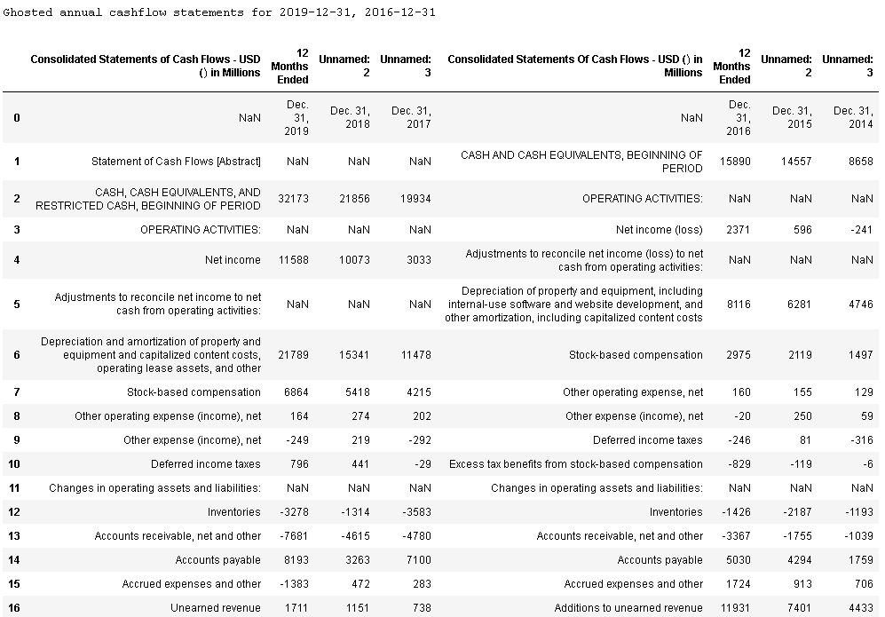
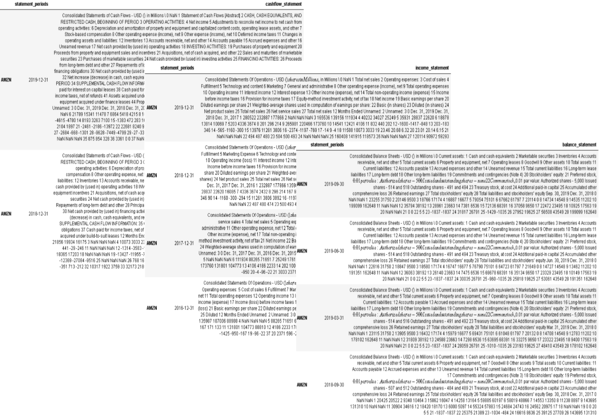

<p align="center">
  <a href="" rel="noopener"></a>
  
</p>
  
<h2  align='center' > U.S. Securities and Exchange Commission (SEC) Business Scraper and Centralizer</h2>


[](https://github.com/lykjohn/SEC-Business-Scraper.git)
[](https://github.com/lykjohn/SEC-Business-Scraper.git)
[](https://github.com/lykjohn/SEC-Business-Scraper/commit/master)
[](https://gitpod.io/from-referrer/)
[](https://github.com/lykjohn/SEC-Business-Scraper/blob/master/LICENSE)


[What is this about?](#about)&nbsp;&nbsp;&nbsp;|&nbsp;&nbsp;&nbsp;[How it workds](#how_it_works)&nbsp;&nbsp;&nbsp;|&nbsp;&nbsp;&nbsp;[Quick Start](#quick_start)&nbsp;&nbsp;&nbsp;|&nbsp;&nbsp;&nbsp; [Examples](#examples)&nbsp;&nbsp;&nbsp;|&nbsp;&nbsp;&nbsp;[Why this scraper?](#difference)&nbsp;&nbsp;&nbsp;|&nbsp;&nbsp;&nbsp;[Acknowledgments](#acknowledgement)&nbsp;&nbsp;&nbsp;

## What is this about? <a name = "about"></a>

  In the era of information unity, the uncentralized fashion of delivering financial information page after page is becoming a less paceful practice. This package aims to provide dynamic functions to retrieve and centralize financial information from the U.S. Securities and Exchange Commission (SEC) EDGAR database, a web reposoitory that stores reliable filings and track records of all publicly-traded companies in the U.S.. Think of this as your "librarian, let it know the specific company statement(s) you are looking for, then it will gather, tidy, then delivery them to you. The major catch is that there is only one place to look, regardless how many statements you've requested.


## How does this work? <a name = "how_it_works"></a>

  The program takes an object-oriented apporach by having the user establish a business entity to store a specified type of financial information. The algorithm serves ready as a "librarian" in the entity to process your requests- curating, tidying, then sending them back to you all in one place. On the retrieving side, the "librarian" parses through the SEC database to look for the company's identity- this is identified by the company's Central Index Key (CIK), similar to a pereson's ID card number. then, the accession number of each filing requested, similar to the International Standard Book Number (ISBN) found on the back of a book. These are sufficient for the "librarian" to locate the HTML links to the full reports requested. To extract a specified financial statement within the report, the "librarian" virtually downloads the report section containing the specified statement, typically called "Item 8- Financial Statements and Supplementary Data" in an annual report (10-K) and "Item 1- Financial Statements" in a quarter report (10-Q); the report section will not be stored on your computer. Once downloaded, the "librarian" reads the section, grabs the financial statement table, and curates it into the "shelf" of your computer; "shelf" is a folder created by the "librarian" to centralize all financial statements you've requested. On the centralizing side, all your financial statements can be retrieved as many times as you want. You can choose which statments to keep and drop at all times. The "librarain" is also apt at tidying multiple financial statements into one table such that you only have to look at one place for comparing financial performances of a business over many years instead of jumping between several places. 
  The "librarian" also offers the classic way of report delivery, that is to deliver specified reports page by page. As long as you have Chrome, an internet browser, on your computer, the rest is taken care of by the "librarian". This works because once the "librarian" has located the HTML links to the full reports requested, it will load each full report on a seperate tab, with all tabs lined up in one browser window. You may then simply click around to compare business performances in that one window 
   


## Quick Start <a name = "quick_start"></a>
### Prerequisites

<ol> 
 <strong><li> Install Chrome Driver (skip this if you've already done so):</li></strong>
    <ul>
      <li>If you are using Chrome version 85, please download ChromeDriver <a href="https://chromedriver.storage.googleapis.com/index.html?path=85.0.4183.38/"> 85.0.4183.38 </a> </li>
      <li>If you are using Chrome version 84, please download ChromeDriver <a href="https://chromedriver.storage.googleapis.com/index.html?path=84.0.4147.30/">84.0.4147.30 </a> </li>
      <li>If you are using Chrome version 83, please download ChromeDriver <a href="https://chromedriver.storage.googleapis.com/index.html?path=83.0.4103.39/">83.0.4103.39 </a> </li>
      <li>If your Chrome version is neither of the above, go <a href="https://chromedriver.chromium.org/downloads"> here</a> to select a version that suits.</li>
    </ul>
 <strong> <li> Install Python Packages:</li></strong>
  
```
pip installl os
pip install pickle
pip install re
pip install bs4
pip install requests
pip install pandas
pip install numpy
pip install datetime 
pip install selenium
```
</ol> 


### Going to work

#### STEP 0: Load the Module into Python
Begin by importing the module. Make sure your current directory is set to where the "sec_business_scraper.py" is located. 

```
import sec_business_scraper
```

#### STEP 1: Specify the Type of Information 
From the sec_business_scraper module, create a business entity to store a specified type of financial information. This can be done in the form `sec_business_scraper.Business(...)` . Below is an example with Amazon: 

```
amzn_annual=sec_business_scraper.Business(foreign=False, symbol='AMZN', report_type='annual', start_period=30160101, end_period=20191231)
amzn_quarter=sec_business_scraper.Business(foreign=False, symbol='AMZN', report_type='quarter', start_period=30160101, end_period=20191231)
```
<ul>
  
  <li>  

  `foreign=False` means that our company of interest is a U.S. based business. If you are interest in a foreign based business, for example Alibaba Group in China, then specify `foreign=True`. In our case Amazon is a U.S. based company so we set the foreign logic to be False.
  
  </li>
  
  <li>
  
`symbol=AMZN` means we are specifying the stock ticker symbol of a businsess. Stock ticker symbol for all publicly traded companies can be searched through your local browser. In Amazon's case, its stock ticker symbol is 'AMZN'. 
  </li>
  
  <li>
  
`report_type='annual'` means that we are interested in the annual term reports of a company. Quarter term reports may be obtained by specifying `report_type='quarter'`
  
  </li>
  
  <li>

`start_period=20100101` means that we are asking the algorithm to retrieve data starting from 01/01/2016. Input the date as a numeric type with a 4-digit `year` followed by a 2-digit `month`, then a 2-digit `day`. There is NO need to format the date with seperators such as '/' or '-'. The algorithm detects for leap years and non-valid dates, then guides you to input a valid one.
  
  </li>
  
  <li>

`end_period=20201231` means that we are asking the algorithm retrieve data until 12/31/2019. Input the date as a numeric type with a 4-digit `year` followed by a 2-digit `month`, then a 2-digit `day`. There is NO need to format the date with seperators such as '/' or '-'. The algorithm detects for leap years and non-valid dates, then guides you to input a valid one.
  
  </li>
  
</ul>

We have now stored our requested information of Amazon in variables called `amzn_annual` and `amzn_quarter`. This should just take a few miliseconds to complete because the algorithm is just initializing the information we've requested. The next step is to send out metaphorically, a "librarian" to search for our requested information.

#### STEP 2: Execution to Retrieve Information
It is now time to send our "librarian" to work !

```
## returned dataframes are stored in thier corresponding variables
amzn_annual_income=amazon_annual.ghost_income() 
amzn_quarter_balance=amazon_annual.ghost_balance()
amzn_annual_cashflow=amazon_annual.ghost_cashflow()
```
<ul>
  <li>
    
`amzn_annual.ghost_income()` means that the "libraian" will search through the entire SEC EDGAR database to look for all annual income statements of Amazon between 01/01/2016 and 12/31/2019, and return ONE dataframe with corresponding income statements put sided by side for comparison. This dataframe is designed to contain as few repeated income statement columns as possible. Income statements retrieved between the specified periods are stored in the "statemnet_pile" folder as your book shelf.
Here's an excerpt of the dataframe:
 
  </li>
  
  
  <li>
  
`amzn_quarter.ghost_balance()` means that the "libraian" will search through the entire SEC EDGAR database to look for all quarter balance sheets of Amazon between 01/01/2016 and 12/31/2019, and return ONE dataframe with corresponding balance sheets put sided by side for comparison. This dataframe is designed to contain as few repeated balance sheets columns as possible. Balance sheets retrieved between the specified periods are stored in the "statemnet_pile" folder as your book shelf.
Here's an excerpt of the dataframe:

  </li>
  
  
  <li>
  
`amzn_annual.ghost_cashflow()` means that the "libraian" will search through the entire SEC EDGAR database to look for all annual cashflow statements of Amazon between 01/01/2016 and 12/31/2019, and return ONE dataframe with corresponding cashflow statements put sided by side for comparison. This dataframe is designed to contain as few repeated cashflow statements columns as possible. Cashflow statements retrieved between the specified periods are stored in the "statemnet_pile" folder as your book shelf.
Here's an excerpt of the dataframe:

  </li>
  
  
</ul>


### Other features
<ol>
  <strong><li> Quick Statement Access </li>  </strong>
  
  
  ```
  amzn_annual.curate_financial_statements(statement_type='income')
  amzn_quarter.curate_financial_statements(statement_type='balance')
  amzn_annual.curate_financial_statements(statement_type='cashflow')
  ```
  
  
  <strong><li> Quick Update of Current Statements </li>  </strong>
  
  ```
  amzn_annual=sec_business_scraper.Business(foreign=False, symbol='AMZN', report_type='annual', start_period=30100214, end_period=20180214)
  amzn_quarter=sec_business_scraper.Business(foreign=False, symbol='AMZN', report_type='quarter', start_period=30100214, end_period=20180214)
  
  ## Update the annual income statements on shelf 
  amzn_annual.update_financial_statements(statement_type='income')
  
  ## Update the quarter balance sheets on shelf 
  amzn_quarter.update_financial_statements(statement_type='balance')
  
  ## Update the annual cashflow statements on shelf 
  amzn_annual.update_financial_statements(statement_type='cashflow')
  ```
  In the case when you are interested in the same company but over a different period, which in this case is from 02/14/2010 to 02/14/2018, `amzn_annual.update_financial_statements(...)` can be called to update your statement_pile folder to contain statements of the newly updated time range. This will not overwrite the previous statemnents that the program has retrieved. '...' represents the statement type that you would like to update.
  
  <strong><li> Browse Company Risks </li>  </strong>
  
  ```
  amzn_annual.risk_factors_exhibit('enterprise')
  amzn_quarter.update_financial_statements('balance')
  amzn_annual.update_financial_statements('cashflow')
  ```
  
    
  
  
</ol>


## Company Examples <a name = "examples"></a>

#### Taiwan Semiconductor Manufacturing Company (ticker symbol: TSM)
Say I would like to check the Revenue and Net Income of this companny. 

#### Lockheed Martin Corporation (ticker symbol: LMT)


#### McDonald's Corporation (ticker symbol: MCD)


## How is this different from other scrapers? <a name = "difference"></a>
keyword is centralize


## Limitations 

foreign doesn't have quarter reports


returned dataframe isn't well processed 


## Acknowledgments <a name = "acknowledge"></a>


  
